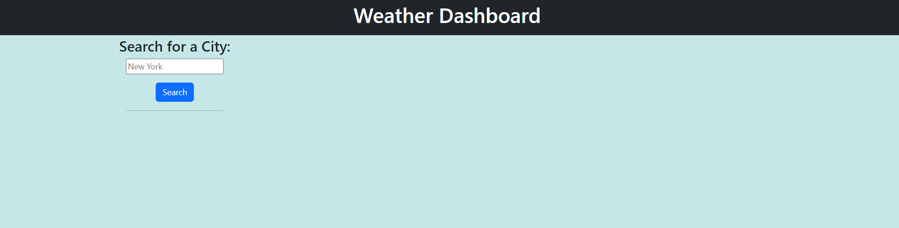
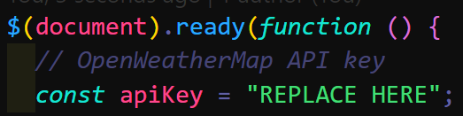

# Weather Dashboard

Weather Dashboard is a web application that allows users to check the current weather and forecast for a specific city. It utilizes the OpenWeatherMap API to retrieve weather data and provides a user-friendly interface for quick and easy access to weather information.

## Features

- **Current Weather Display:** View the current temperature, humidity, and wind speed for a chosen city.
- **Forecast Display:** Check the 5-day weather forecast with temperature, weather icons, and humidity information.
- **Search History:** Keep track of previously searched cities for quick access.

## Table of Contents

- [Getting Started](#getting-started)
  - [Prerequisites](#prerequisites)
  - [Installation](#installation)
- [Usage](#usage)
- [Configuration](#configuration)
- [Folder Structure](#folder-structure)
- [Technologies Used](#technologies-used)
- [Contributing](#contributing)
- [License](#license)
- [Acknowledgments](#acknowledgments)

## Getting Started

### Prerequisites

- Ensure you have a valid OpenWeatherMap API key. You can obtain one by signing up on the [OpenWeatherMap website](https://openweathermap.org/).

### Installation

1. Clone the repository: `git clone https://github.com/ramonsaguini/WeatherDashboard`
2. Open the `index.html` file in your preferred web browser.

### Usage

1. Enter the name of a city in the search input field.
2. Press the "Search" button or hit "Enter" to retrieve weather information.
3. The current weather and a 5-day forecast will be displayed.
4. Click on a city in the search history to view its weather again.

### Configuration

- Before using the application, replace the placeholder API key in the `script.js` file with your OpenWeatherMap API key.

### Folder Structure

- **CSS:** Contains stylesheets for the application.
- **JS:** Contains the JavaScript logic for fetching and displaying weather data.
- **index.html:** The main HTML file for the Weather Dashboard.

### Technologies Used

- **HTML/CSS/JavaScript:** The core technologies for building the web application.
- **Bootstrap 5:** Used for styling and layout.
- **Day.js:** A lightweight alternative to Moment.js for handling dates.
- **jQuery:** Used for DOM manipulation and AJAX requests.

### Contributing

Feel free to contribute to the development of this Weather Dashboard. Fork the repository, make your changes, and submit a pull request.

### License

This project is licensed under the MIT License - see the [LICENSE](./LICENSE) file for details.

### Acknowledgments

- Weather data provided by OpenWeatherMap.
- Icons by Icons8.

Happy weather checking! ☀️🌧️⛅
